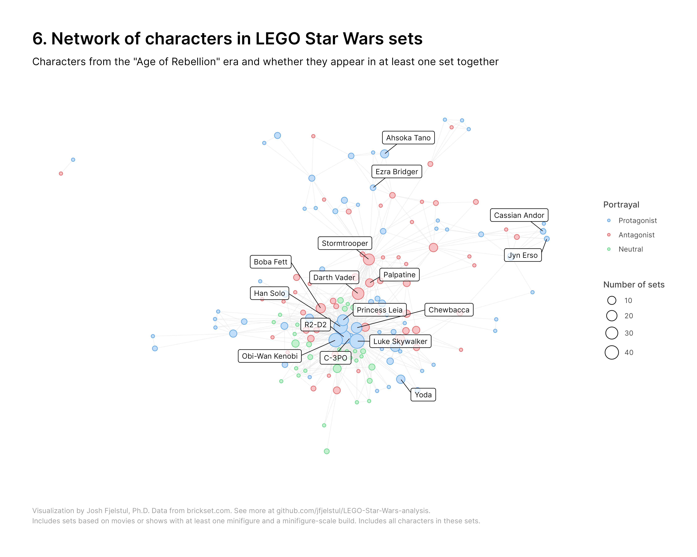

# How does LEGO depict conflict in Star Wars sets? 

LEGO themes often depict conflict between factions. Some sets only include good guys, some only include bad guys, and some include both — directly depicting conflict. How LEGO distributes protagonists and antagonists across sets influences the play experience for children, especially when a child only has the opportunity to get one or two sets from a theme. If a child's sets only include protagonists or antagonists, their play experience will likely be different than if they include both. 

LEGO strategically designs sets to optimize some combination of sales revenue and the play experience for consumers. A critical aspect of set design is which minifigs to include. So what's LEGO's strategy? How often do LEGO sets directly depict conflict by including protagonists and antagonists in the same set, as opposed to including only protagonists or only antagonists, and how has LEGO's minifig-inclusion strategy changed over time?

With Star Wars day coming up, let's take a look at the Star Wars theme — an enduringly popular theme with clear factions and hundreds of sets spanning over two decades. We'll use data from Brickset and data visualization to answer these questions. First, we'll select a sample of Star Wars sets to analyze. Second, we'll take a look at the minifigs that appear in these sets. And third, we'll use data visualization to explore how LEGO depicts conflict in these sets based on their minifig-inclusion strategy. 

## Star Wars sets

The first thing we need to do is select a sample of sets to analyze. Brickset's database currently includes over 890 Star Wars sets, but we'll restrict our sample to what we might call standard play sets — sets that include at least one minifig and a minifig-scale build.

We'll also restrict our sample to sets that are based on a Star Wars movie or TV show. For movies, we'll include Episodes I through IX, Rogue One, and Solo. For animated shows, we'll include The Clone Wars, Rebels, Resistance, The Bad Batch. For live-action shows, we'll include The Mandalorian, The Book of Boba Fett, Obi-Wan Kenobi, and Andor. We'll use Brickset's subtheme tags to extract sets based on these movies and shows. We'll then drop any sets that don't include any minifigs or that don't include minifig-scale builds.

By applying these criteria to our sample of sets, we'll exclude some entire sub-themes, including Ultimate Collector Series (UCS) sets, Technic sets, mini-scale sets, MicroFighters, and buildable figures, among others. We'll also exclude promotional sets, gifts, and product collections.

There are 362 sets that meet our criteria. Figure 1 shows all of these sets by year of release, broken down by Star Wars era. Each set is a point, and the size of each point indicates the number of pieces in the set. At this year's Star Wars Celebration — a few weeks ago in London — Disney unveiled a new Star Wars timeline with nine eras. The movies and shows we're looking at come from five of these eras: Fall of the Jedi (Episodes I through III and The Clone Wars), Reign of the Empire (Solo, Obi-Wan Kenobi, The Bad Batch, Andor), Age of Rebellion (Episodes VI through IV, Rogue One, Rebels), The New Republic (The Mandalorian, The Book of Boba Fett), and Rise of the First Order (Episodes VII through IX, Resistance).

The number of minifig-scale sets has decreased over the last several years. This is part of a new strategy by LEGO to allocate more of its Star Wars portfolio to adult-focused sets like the helmet and diorama collections. Another consequence of this strategy is a notable increase in set size since 2018.

Since Disney acquired Lucasfilm, the timeline has expanded and the distribution of LEGO sets reflects this. LEGO has released substantially fewer sets based on the Fall of the Jedi and Age of Rebellion eras to make room in its product portfolio for sets based from The Mandalorian, The Bad Batch, and Andor.

## Star Wars minifigs

Next, we'll take a look at the minifigs that appear in our sample of sets. Based on Brickset's definition of a minifig, our sample includes 921 unique minifigs. We'll use Brickset's tags to identify which Star Wars character each minifig depicts. These 921 minifigs capture 380 unique Star Wars characters. Many of these characters are named characters (Luke Skywalker), but some are generic characters (Clone Trooper) that could have many variants. 

For our analysis, we'll need to code whether each character is portrayed as a protagonist, as an antagonist, or as a neutral character. We'll do this by first coding any factions that a character is affiliated with. This can be tricky because a character's faction can change over time. Boba Fett is a good example. He's an antagonist in Episodes V and VI but a protagonist in The Book of Boba Fett. We'll handle this by coding each character's factions by era. For example, Luke's faction during the Age of Rebellion era would be the Rebel Alliance, and his faction during the Rise of the First Order era would be the Resistance. 

Not all characters are clear-cut, though. We'll code a character's overall portrayal in each era. For example, we'll code Lando Calrissian as a protagonist in the Age of Rebellion era despite scenes in The Empire Strikes Back where he's depicted as an antagonist for betraying Han Solo. There's some room for disagreement in coding this variable. Check out the data if you want to see the coding for specific characters. 

We can visualize the relationship between sets and characters using a network. Networks consist of nodes and edges, which connect nodes together. Figure 2 shows a network with two different types of nodes — the squares are sets and the circles are characters. Each character is connected to every set that one of their minifigs appears in. Characters aren't connected directly to each other, but they are connected indirectly through the sets they appear in together. The size of the each circle indicates how many unique minifigs the character has. The color of the circle indicates whether the character is portrayed as a protagonist, as an antagonist, as a mix of both (depending on the era), or as a neutral character.

This network has two major clusters — one for the Age of Rebellion era and one for the Fall of the Jedi era. There's a smaller cluster at the bottom right for the Rise of the First Order era and a loose cluster at the top left for the Reign of the Empire and The New Republic eras, both of which are closely tied to the Age of Rebellion era. 

There's a lot going on here, so let's also visualize the characters in this network separately. Figure 3 shows all characters in our sample of sets by era and faction. The colors indicate whether each character is affiliated with the main protaginst faction in the era (the Galactic Republic, the Rebel Alliance, or the Resistance), the main antagonist faction in the era (the Confederation of Independent Systems, the Galactic Empire, or the First Order), or some other faction. The size of each circle indicates how many unique minifigs the character has.

Let's also take a closer look at the most common minifigs. Figure 4 takes the 30 most common characters in our sample of sets and shows how many sets each character appears in each year. The most common characters appear in at least one set nearly every year. The majority are protagonists. 

Of the 380 unique characters in our sample, 187 are human, 106 are aliens, 77 are droids, and 10 are humanoid, but it's unclear from cannon whether they're human or alien. There are 66 unique species of alien (some species are unknown). The most common species are Zabraks (6), Ewoks (5), Weequay (5), Geonosians (4), Mon Calamari (4), Twi'leks (4), and Wookiees (4). 

## How LEGO depicts conflict

How does LEGO depict conflict in Star Wars sets? Using our data on sets and minifigs, and some more data visualization, we can explore LEGO's minifig-inclusion strategy — how often LEGO includes both protagonists and antagonists in the same sets. 

We'll start by taking the most common characters in our sample of sets and looking at how often protagonists and antagonists appear together in at least one set. Figure 5 shows a network that uses a visualization technique called hierarchical edge bundling. In this network, there's one node for each character, and these nodes are arranged in a circle. The size of the node indicates how many sets the character appears in. The network includes all characters that appear in at least five sets.

The characters are grouped (that's the "hierarchical" part) based on their overall portrayal in the source material. There's an edge connecting every pair of characters that appear in at least one set together. Edges that connect nodes from different groups — lines connecting a protagonist and antagonist, for example — are bundled together (the "edge bundling" part). 

We're looking to see how many connections there are between protagonists and antagonists — how large that bundle of edges is. In this network, there are more edges between the protagonist and antagonist groups (113) then within the protagonist group (92) or the antagonist group (52). This indicates that LEGO's strategy dominant strategy is to include both protagonists and antagonists in Star Wars sets.

Next, we'll look at the data by era. Figure 6 shows a network of characters from the Age of Rebellion era. Each node in the network is a character and each edge indicates that a pair of characters appears together in at least one set. The size of each node indicates the number of sets that the character appears in. 

This network has a clear structure. There are three main clusters. The main cluster contains characters that appear in Episodes IV through VI. A second cluster at the top includes characters from Rebels. A third cluster on the right includes characters from Rogue One and Andor. The main cluster is connected to the other two primarily through antagonists. Luke, Jyn, Cassian, and Ezra are all fighting against the Empire. 

In the main cluster, there's a sub-cluster of protagonists at the center and a looser but still clearly visible sub-cluster of antagonists above and to the right. This is what we're most interested in. The tightness of these clusters — and of the cluster of protagonists, in particular — indicates that there are sets that only include protagonists or only include antagonists. But the fact that these two clusters are so closely connected to each other also indicates a high proportion of sets that include both protagonists and antagonists.

Figure 7 shows a similar network for the Fall of the Jedi era. The structure of this network is less well-defined. The sets from this area are based more on The Clone Wars than on Episodes I through III, so there is only one main cluster. The protagonists and antagonists are also less clearly clustered. This indicates that, relative to sets from the Age of Rebellion era, sets from the Fall of the Jedi era are more likely to include both protagonists and antagonists.

Finally, we'll look at the proportion of sets that include both protagonists and antagonists, as opposed to only protagonists or only antagonists, and how that proportion changes over time. This will allow us to identify any shifts in LEGO's minifig-inclusion strategy.

Figure 8 shows a stream plot that visualizes the over-time changes in these proportions. The width of the stream indicates the total number of sets released in each year. From 1999 to 2015, there was a steady increase in the total number of sets in our sample. As we see in Figure 1, there has been a steep decrease since 2018 as LEGO has released more on adult-focused sets. 

Between 2007 and 2016, there was a substantial increase in the proportion of sets that directly depict conflict by including both protagonists and antagonists. In 2022, 64 percent of sets included both protagonists and antagonists, up from 15 percent in 2007. This signals a clear shift in LEGO's minifig-inclusion strategy towards including both protagonists and antagonists in sets. We don't have set-specific sales data, but one plausible explanation for this shift is that sets with minifigs from opposing factions tend to sell better. 

## A shift in strategy 

LEGO’s minifig-inclusion strategy has changed significantly over time. There has been a dramatic increase in the proportion of sets that directly depict conflict by including protagonists and antagonists in the same set.

LEGO’s change in strategy affects the play experience for kids. If you're working with a limited budget, it's now easier to get minifigs from opposing factions — on average, you don't have to buy as many sets. This may be good for children who want to have both protagonists and antagonists to play with, but it also encourages a play experience that is more explicitly centered around the conflicts depicted in the source material.
